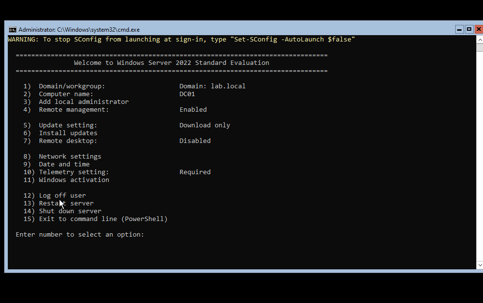
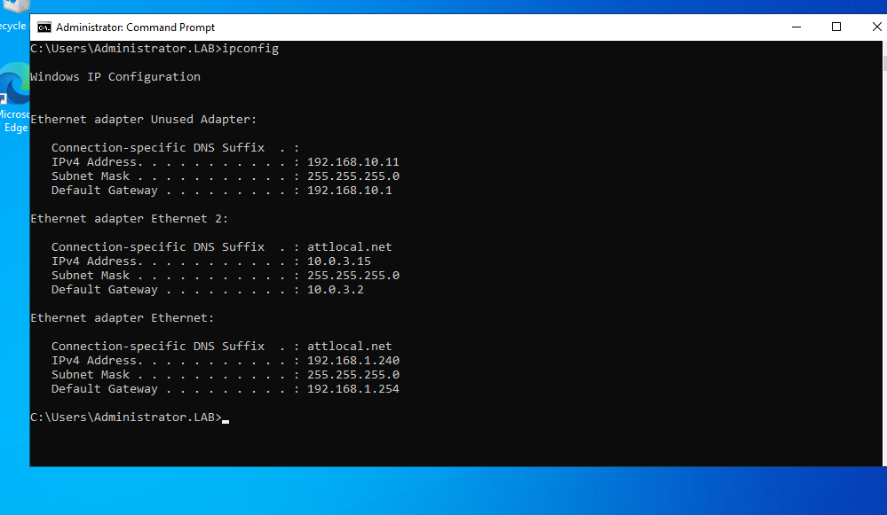

When designing this homelab environment, I decided to deploy two Windows Server 2022 domain controllers within VirtualBox to mirror best practices used in a real enterprise environment. Having multiple domain controllers provides high availability, replication, load distribution, and disaster recovery. 

**DC01 - Primary Domain Controller (Server Core)**

Why server core? DC01 is intentionally designed to be deployed as a Windows Server 2022 server core because it:

-Provides a smaller attack surface

-Allows for redundancy and lower resource usage

-Simpler patching requirements

Configuration
OS: 

      -2022 Windows Server Core
      
Roles: 

      -Active Directory Domain Services
      
      -DNS Server
      
Networking:

      -Primary NIC: 192.168.10.10
      
      -Secondary NIC (SIEM Subnet): 192.168.1.239
      
Tools Used: 

      -PowerShell
      
      -SConfig
      
      -RSAT (Allows for disaster recovery if DC02 goes down)
      
Responsibilities:

      -Host main local domain (lab.local)
      
      -Hold all FSMO roles initially
      
      -Provide primary DNS services
      
      -Act as primary Domain Controller
      

DC01 Main Interface (SConfig):

System Information:

DC01 IP Configuration:

FSMO Roles:

Domain Controller Status:

**DC02 - Full GUI**

DC02 is designed to be a redundant Domain Controller and primary file share for the network. It provides fault tolerance, replication, and a GUI-based interface for
server management.

Why full GUI?
DC02 is intentionally deployed as a Windows Server 2022 Desktop Experience to:

-Give visual access to AD tools

-Provide fallback management interface if RSAT fails

-Simulate real world environments with a mix of Core and GUI DCs

-Have easier troubleshooting and management

Configuration:
OS: 

    -Windows Server 2022 Desktop Experience
    
Roles Installed:

    -Active Directory Domain Services
    
    -DNS Server
Domain:

    -lab.local
    
Networking:

    -Primary NIC 192.168.1.11 (Internal Domain)
    
    -Secondary NIC: 10.0.3.15 (NAT Adapter)
    
    -192.168.1.240 (SIEM Subnet)

Responsibilities:

      -Serve as file share for NTFS permission testing

      -Provide redundancy for authentication, DNS, and GPO delivery

      -Replicate AD objects and DNS zones from DC01

      -Serve as a GUI-based management interface for AD

      -Act as a secondary log source for SIEM integration

Management Tools

Because DC02 has a full GUI, it includes all native Windows Server management consoles, including:

      -Active Directory Users and Computers
      
      -DNS Manager
      
      -Group Policy Management Console
      
      -Event Viewer
      
      -Server Manager     
      
      -PowerShell

All of these tools were used to:

      -Create new users, groups, and OUs

      -Configure and link GPOs
      
      -Verify replication and DNS 
      
      -Monitor security logs and SEM agent activity
      
DC02 Domain Information:

    
Domain Replication with DC01:

IP Configuration for DC02:

DNS Manager: 

The four folders within the file share system are shown in the photo below: 

Each folder has its own access control assigned to it via RBAC. Here is an example:

 

Users inside the Administrators group have full control over the file share, as seen below: 

RBAC is administered through security groups. Expanded below is the IT Administrator Group: 

**Group Policy**

To showcase group policy in the environment, the following shows an automatic shared network drive mapping layout that allows for users under the HR Admin Groups to have their HR drive automatically map. 
To see this group policy in action, I have provided the video under the Lab-PC portion of this repository. The following is configuration of this group policy on DC02: 

Link to OU: 

Policy Mapped:

Direct Targeting for Security Groups:

