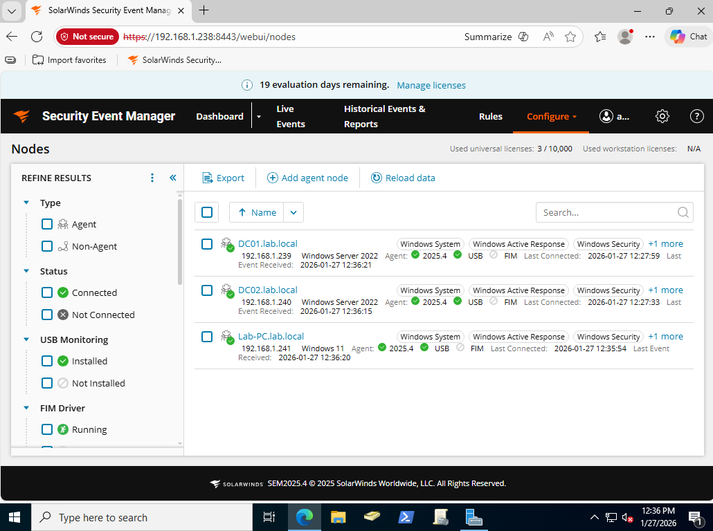

**SolarWinds Security Event Manager**

This section documents the integration of my Active Directory environment with SolarWinds Security Event Manager (SEM). The goal was to simulate a realistic SOC workflow by forwarding Windows Security logs from my Windows 
machines, validating event ingestion, creating custom filters and rules, and generating alerts based on domain activity.

SolarWinds was deployed as a VirtualBox appliance on the SIEM network (192.168.1.0/24) and configured to ingest logs from both domain controllers and Lab-PC. 

SEM Dashboard Overview: 

This photo shows the SolarWinds main dashboard. Customizable widgets display security events and information for easy access. 

Network Nodes:

Normalized Event (Failed Logon): 

This photo shows a normalized event broadcasted to the Live Events panel. I triggered this event by doing a few failed login attempts for my administrator account on DC01. 

.png)
